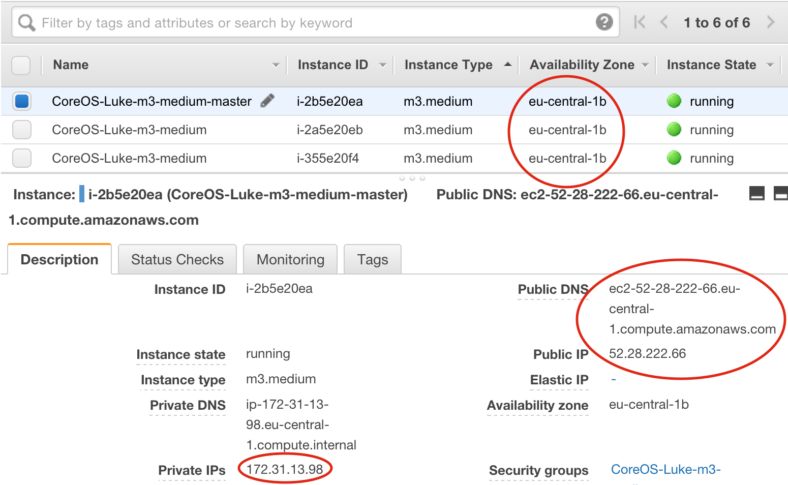

TODO update this with latest tweaks from blog post

# Flocker on CoreOS quickstart
## Step 1: provision some CoreOS nodes

* Go to [CloudFormation](https://console.aws.amazon.com/cloudformation/home#/stacks?filter=active)
* Create a new stack
* Download [this template](https://raw.githubusercontent.com/ClusterHQ/flocker-coreos/master/coreos-stable-hvm.template) (right click, save file as) to your computer and then upload it to CloudFormation
   * This is a modified version of the CoreOS CloudFormation template which puts all the nodes in the same AZ (necessary so that they can access the same storage)
   * It also gives the nodes 50GB root disks, for storing Docker images
* Follow the on-screen instructions, such as specifying discovery token and access key, and then wait for your nodes to appear in [EC2](https://console.aws.amazon.com/ec2/v2/home)

## Step 2: create `cluster.yml` for Flocker nodes

* Install [Unofficial Flocker Tools](https://docs.clusterhq.com/en/latest/labs/installer.html)
    * You will need Unofficial Flocker Tools 0.3 or later for CoreOS support, use `pip show UnofficialFlockerTools` to check the version.

* Pick a node from EC2 to host the control service, label it as the master (see screenshot)

* When you create a `cluster.yml`, you will need the following details from the AWS control panel:



The `cluster.yml` should look like this, see screenshot for where to get much of this information from:
```
cluster_name: <descriptive name>
agent_nodes:
 - {public: <node 1 public IP>, private: <node 1 private IP>}
 - {public: <node 2 public IP>, private: <node 2 private IP>}
 - {public: <node 3 public IP>, private: <node 3 private IP>}
control_node: <DNS name of the master node>
users:
 - coreuser
os: coreos
private_key_path: <path on your machine to your .pem file>
agent_config:
  version: 1
  control-service:
     hostname: <DNS name of the master node>
     port: 4524
  dataset:
    backend: "aws"
    region: <region, e.g. us-east-1>
    zone: <zone that the nodes showed up in>
    access_key_id: <your AWS access key>
    secret_access_key: <your AWS secret key>
```
## Step 3: configure root access to nodes

* Run the following script from your computer, replacing the list of nodes with the public IP addresses of the nodes:

```
for X in <node 1 public IP> <node 2 public IP> <node 3 public IP>; do
    ssh -i <path on your machine to your .pem file> core@$X \
        'sudo mkdir /root/.ssh && \
         sudo cp .ssh/authorized_keys /root/.ssh/authorized_keys'
done
```

## Step 4: run flocker-config

* This is a tool from Unofficial Flocker Tools which will deploy the Flocker containers on your nodes:

```
flocker-config cluster.yml
```

* When it's finished, try this to check that all your nodes came up:

```
flocker-volumes list-nodes
```

* Now you can start using Flocker on your CoreOS cluster!

# TODO - demo integration with flocker docker plugin and fleet
